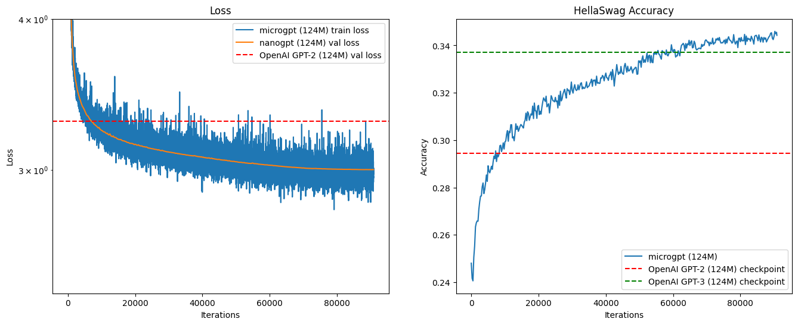

# microgpt

A micro GPT implementation and training pipeline in PyTorch. I built this to understand a few
things:

- Basics of attention and RoPE
- Training a GPT-like model with multiple GPUs including checkpointing and other considerations
to make the run successful
- Multi phase training including combining/souping the model weights for the second stage with 3
runs of smaller amounts of high quality data

The model itself is very simple and I didn't include any fancy new features. A better future
version might include some of these but are out of scope for this project (It's very costly!):

- Post training features:
  - Supervised finetuning
  - Reinforcement learning
- Model features:
  - Variations of attention mechanisms - GQA, MHLA, etc.
  - Variations of normalizations - LayerNorm, RMSNorm, etc.
  - Experimenting with post-normalization similar to OLMo
  - Mixture of experts

## Pretrained model

The pretrained models can be found in the [pretrained](pretrained) directory. It was trained in 2
stages:

1. Stage 1: Training using large amounts of mostly web based data
2. Stage 2: Training using 3 runs of smaller amounts of high quality data and combining/souping the
model weights

### Comparison with OpenAI's GPT-2



### Infrastructure used for training

- 8x H200 SXM GPUs (80GB) on [runpod.io](https://www.runpod.io/)
  - Time taken: ~4 hours
  - Hourly Cost: $32 per hour
  - Total cost: ~$128
- 1 c8g.4xlarge instance on AWS
  - Time taken: ~16 hours
  - Hourly Cost: $0.43184 per hour
  - Total cost: ~$6.75

## Features

- Tokenizer
  - Loading pretrained gpt tokenizers
  - Training custom byte-pair encoding tokenizers
  - Loading custom byte-pair encoding tokenizers from files
- Micro GPT model implementation
  - Loading pretrained gpt models
  - Training custom gpt models with support for DDP
  - Training checkpoints
  - Loading custom gpt models from files
- Training using text, files, urls or huggingface datasets
- RoPE implementation
- Reproducing GPT-2 with a custom tokenizer and model
- HellaSwag eval
- 2 stage model training including combining/souping the model weights for the second stage with 3
runs of smaller amounts of high quality data

## Usage

- Install [uv](https://docs.astral.sh/uv/getting-started/installation/)

- Install [make](https://www.gnu.org/software/make/)

- Setup a virtual environment

```sh
uv venv --python 3.12
source .venv/bin/activate
```

- Install dependencies

```sh
make sync
```

- Download the pretrained model and tokenizer

```sh
python scripts/download_pretrained.py
```

- Example usage:

```python
from microgpt.model import (
    load_model,
    PretrainedModelConfig,
)

model = await load_model(
    config=PretrainedModelConfig(),
)
generated_text = model.generate_text(
    text="Hi, I'm a language model,",
    max_new_tokens=50,
)
```

- Go through the [notebooks](notebooks) to understand how to use the library.

## Acknowledgements

- [Neural Networks: Zero to Hero by Andrej Karpathy](https://www.youtube.com/playlist?list=PLAqhIrjkxbuWI23v9cThsA9GvCAUhRvKZ)
- [karpathy/minbpe](https://github.com/karpathy/minbpe)
- [karpathy/nanoGPT](https://github.com/karpathy/nanoGPT)

## License

This project is licensed under the MIT License. See the [LICENSE](LICENSE) file for details.
